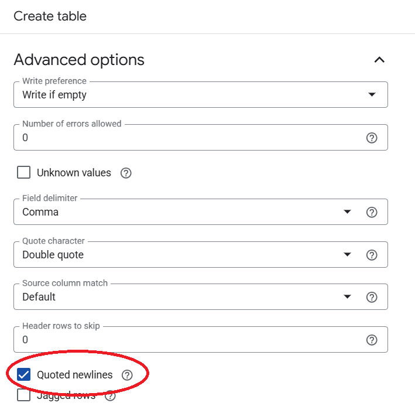

To ingest the olist_order_reviews_dataset.csv using `dbt seed`, use the following code (from ChatGPT) to clean the csv file and then `dbt seed` the cleaned file. I tried to include `allow_quoted_newlines = true` for seeds in the `dbt_project.yml` but it doesn't work.

```python
import csv

input_file = 'olist_order_reviews_dataset.csv'
output_file = 'olist_order_reviews_dataset_cleaned.csv'

with open(input_file, 'r', encoding='utf-8', newline='') as infile, \
     open(output_file, 'w', encoding='utf-8', newline='') as outfile:
    reader = csv.reader(infile, quotechar='"', delimiter=',', quoting=csv.QUOTE_ALL, skipinitialspace=True)
    writer = csv.writer(outfile, quotechar='"', delimiter=',', quoting=csv.QUOTE_ALL)
    
    for row in reader:
        cleaned_row = [field.replace('\n', ' ').replace('\r', ' ') if field else '' for field in row]
        writer.writerow(cleaned_row)

print("Cleaned CSV written to", output_file)
```

If creating the table directly in GCP using upload, then just enable the Quoted newlines as shown for the reviews.csv



-----------------------------------------------------------------------------------------------------------------------------------
Objective: To provide a regular report (weekly or monthly, to be configured on dagster) to Olist eCommerce company on their sales status.
-----------------------------------------------------------------------------------------------------------------------------------
Proposed to build a dagster pipeline with the following stages
1. Ingest from Kaggle olistbr/brazilian-ecommerce dataset and unzip
2. Prepare the olistbr/brazilian-ecommerce CSVs for ingestion by cleansing it.
3. Use meltano to ingest to BigQuery
4. Use dbt to transform dataset to STAR schema coupled with dbt test (uniqueness, non-nullable, foreign keys)
5. Use Great Expectations to further perform data validation (TBC test cases)
6. TBC perform dataanalysis and reporting with Pandas and Matplot, etc.
-----------------------------------------------------------------------------------------------------------------------------------

```
cd SCTP-DSF1-Team5/03 - Code/
```

-----------------------------------------------------------------------------------------------------------------------------------
/pipeline-olist
-----------------------------------------------------------------------------------------------------------------------------------
Create a Kaggle API Token (kaggle.json) and place it under /home/youruser/.kaggle/kaggle.json
```
conda activate elt
cd pipeline-olist
pip install kaggle
```

/home/<your username>/SCTP/SCTP-DSF1-Team5/03 - Code/pipeline-olist/pipeline_olist/assets.py  
Implment assets.py to download datasets from kaggle and cleansing

/home/<your username>/SCTP/SCTP-DSF1-Team5/03 - Code/pipeline-olist/pipeline_olist/definitions.py  
Implment definitions to load all assets from assets.py

```
dagster dev
```

-----------------------------------------------------------------------------------------------------------------------------------
/load-olist
-----------------------------------------------------------------------------------------------------------------------------------
```
conda activate elt
cd load-olist
```

/home/<your username>/SCTP/SCTP-DSF1-Team5/03 - Code/load-olist/meltano.yml  
Add and populate extractor information  
```
meltano add extractor tap-csv 
```

To test extractor
```
meltano invoke tap-csv
```

Add and populate loader information, get ready your Big Query Service account key  
Your BigQuery service account key should be located at `/home/<your username>/SCTP/SCTP-DSF1-Team5/03 - Code/credentials/<your bigquery service account key>.json`. 
```
meltano add loader target-bigquery
```

Run your pipeline
```
meltano run tap-csv target-bigquery
```

-----------------------------------------------------------------------------------------------------------------------------------
/transform-olist
-----------------------------------------------------------------------------------------------------------------------------------

-----------------------------------------------------------------------------------------------------------------------------------
/dbt_olist
-----------------------------------------------------------------------------------------------------------------------------------

This is an initial dbt project for sellers, products and order_items using the schema in
the Design folder (olist.pdf)
Source: Kai's Big Query dsai-brazilian-ecommerce Brazilian_Ecommerce dataset (see models/sources.yml)
Check your Big Query project parameters in profiles.yml (currently my project)

Setup environment and authenticate to gcloud. Currently using oauth. I will change it to BigQuery service account key at a later date when all the tests are done.

```
conda activate dwh
gcloud auth application-default login
```
Run 'debug' to check for connection errors.
```
dbt debug
```
If all are good, 
```
dbt run
```
I using views for testing. We will need to add snapshots to do the data cleaning and joining tables for analysis.

-----------------------------------------------------------------------------------------------------------------------------------
/test-olist
-----------------------------------------------------------------------------------------------------------------------------------
TBD Great Expectations